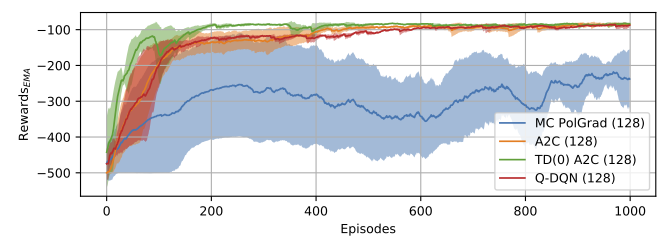
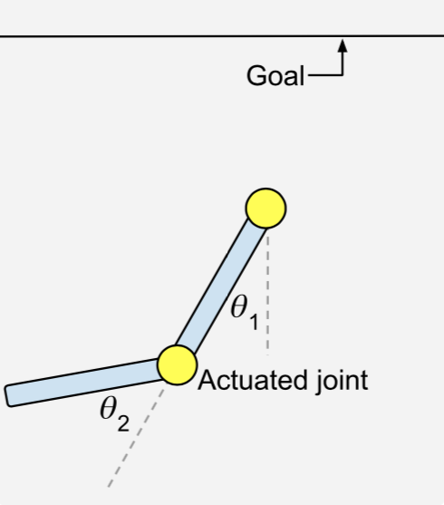

## Acrobot-agents

Development of multiple agents learning the Acrobot-v1 environment of the OpenAI Gym library.

First group of agents uses neuronal networks to estimate the action-value function Q of the continuous state, discrete actions environment. These are semi-gradient Q and SARSA algorithms in a classic and a DQN (deep Q network) approach.

Second group of agents uses neuronal networks to estimate the policy directly. These are Monte-Carlo policy gradient (REINFORCE algorithm), Monte-Carlo Advantage Actor-Critic (A2C) & TD(0)-A2C agents.

Results have been summarised in the PDF and Figures and Videos to visualise the agents' performance are within the respective subfolders.

Additionally, it is shown that the developed Q-learning DQN agent was also capable of solving the harder MountainCar-v0 environment of the OpenAI Gym library.

  
   

